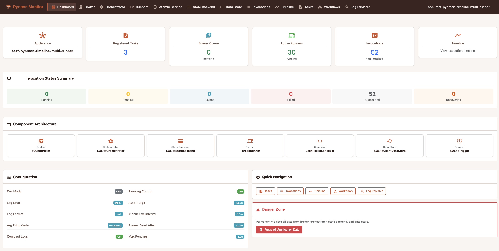
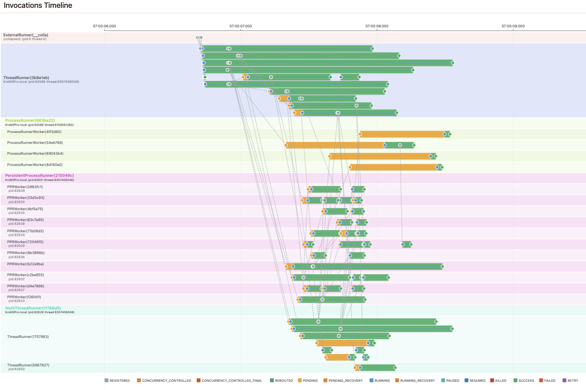
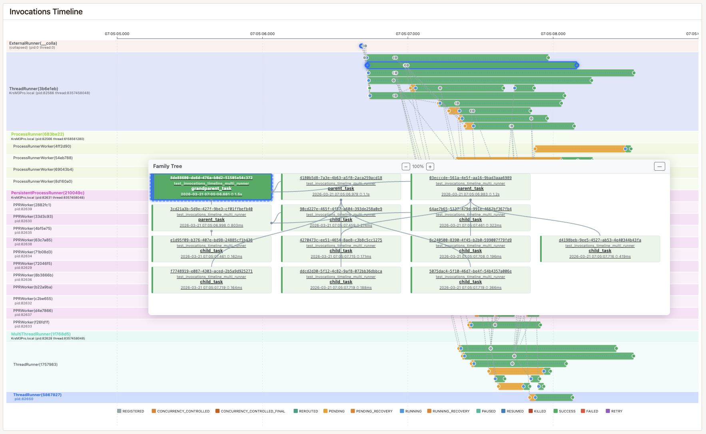
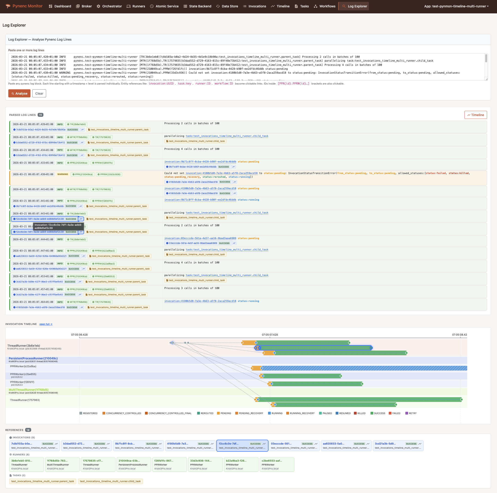

<p align="center">
  
</p>
<h1 align="center">Pynenc</h1>
<p align="center">
    <em>A task management system for complex distributed orchestration</em>
</p>
<p align="center">
    <a href="https://pypi.org/project/pynenc" target="_blank">
        
    </a>
    <a href="https://pypi.org/project/pynenc" target="_blank">
        
    </a>
    <a href="https://github.com/pynenc/pynenc/commits/main">
        
    </a>
    <a href="https://github.com/pynenc/pynenc/graphs/contributors">
        
    </a>
    <a href="https://github.com/pynenc/pynenc/issues">
        
    </a>
    <a href="https://github.com/pynenc/pynenc/blob/main/LICENSE">
        
    </a>
    <a href="https://github.com/pynenc/pynenc/stargazers">
        
    </a>
    <a href="https://github.com/pynenc/pynenc/network/members">
        
    </a>
</p>

---

**Documentation**: <a href="https://docs.pynenc.org" target="_blank">https://docs.pynenc.org</a>

**Source Code**: <a href="https://github.com/pynenc/pynenc" target="_blank">https://github.com/pynenc/pynenc</a>

---

Pynenc addresses the complex challenges of task management in distributed environments, offering a robust solution for developers looking to efficiently orchestrate asynchronous tasks across multiple systems. By combining intuitive configuration with advanced features like automatic task prioritization, Pynenc empowers developers to build scalable and reliable distributed applications with ease.

## 🆕 What's New in v0.2.1

- **Pynmon compatibility**: migrated `TemplateResponse` calls to the Starlette 1.x API, fixing crashes on all pynmon views
- **Monitor stability**: broadened exception handling in app hydration so that lazy-loading modules no longer crash `pynenc monitor`
- **Invocations tab fix**: `extract_module_info` now correctly resolves the user module instead of the pynenc core module
- **Dependency bumps**: FastAPI 0.136.0, Starlette 1.0.0, black 26.3.1, sphinx &lt;10

See the [Changelog](https://docs.pynenc.org/changelog.html) for the complete list of changes.

## Key Features

- **Modular Plugin Architecture**: Pynenc is built with modularity at its core, supporting various backend implementations through a plugin system:

  - **Memory Backend**: Built-in development/testing mode for local execution (single-host only)
  - **SQLite Backend**: Built-in backend for testing on a single host (compatible with any runner sharing the same database file)
  - **Redis Plugin** (`pynenc-redis`): Production-ready distributed task management
  - **MongoDB Plugin** (`pynenc-mongodb`): Document-based storage with full feature support
  - **RabbitMQ Plugin** (`pynenc-rabbitmq`): Message queue-based broker for distributed task orchestration

  The plugin system allows easy extension with additional databases, message queues, and services, enabling customization for different operational needs and environments.

- **Intuitive Orchestration**: Simplifies the setup and management of tasks in distributed systems, focusing on usability and practicality.

- **Flexible Configuration with `PynencBuilder`**: A fluent builder interface allows users to configure apps programmatically with method chaining. Backend plugins automatically extend the builder with their own methods:

  ```python
  from pynenc.builder import PynencBuilder

  # Production setup with Redis (requires pynenc-redis plugin)
  app = (
      PynencBuilder()
      .app_id("my_app")
      .redis(url="redis://localhost:6379")  # Plugin-provided method
      .multi_thread_runner(min_threads=2, max_threads=8)
      .logging_level("info")
      .build()
  )

  # Development/testing setup (no plugins required)
  app = PynencBuilder().app_id("my_app").memory().dev_mode().build()
  ```

- **Invocation Status State Machine**: Type-safe, declarative status management with:

  - Ownership tracking for invocations across distributed runners
  - Automatic recovery of stuck PENDING and RUNNING invocations
  - Runner heartbeat monitoring to detect inactive runners
  - Comprehensive state transitions with validation

- **Configurable Concurrency Management**: Pynenc offers versatile concurrency control mechanisms at various levels:

  - **Task-Level Concurrency**: Ensures only one instance of a specific task is in a running state at any given time.
  - **Argument-Level Concurrency**: Limits concurrent execution based on the arguments of the task, allowing only one task with a unique set of arguments to be running or pending.
  - **Key Argument-Level Concurrency**: Further refines control by focusing on key arguments, ensuring uniqueness in task execution based on specified key arguments.

  This structured approach to concurrency management in Pynenc allows for precise control over task execution, ensuring efficient handling of tasks without overloading the system and adhering to specified constraints.

- **Real-Time Monitoring with Pynmon**: Built-in web-based monitoring interface featuring:

  - SVG-based timeline visualization of invocations and state transitions
  - Runner health monitoring with heartbeat tracking
  - Workflow visualization with parent-child relationships
  - Task details with execution history and context
  - HTMX-powered real-time updates

- **Comprehensive Trigger System**: Enables declarative task scheduling and event-driven workflows:

  - **Diverse Trigger Conditions**: Schedule tasks using cron expressions, react to events, task status changes, results, or exceptions.
  - **Flexible Argument Handling**:
    - **ArgumentProvider**: Dynamically generate arguments for triggered tasks from the context of the condition (static values or using custom functions).
    - **ArgumentFilter**: Filter task execution based on original task arguments (exact match dictionary or custom validation function).
    - **ResultFilter**: Conditionally trigger tasks based on specific result values of the preceding task.
    - **Event Payload Filtering**: Selectively process events based on payload content.
  - **Composable Conditions**: Combine multiple conditions with AND/OR logic for complex triggering rules.

- **Advanced Workflow System**: Sophisticated task orchestration with deterministic execution and state management:

  - **Deterministic Execution**: All non-deterministic operations (random numbers, UUIDs, timestamps) are made deterministic for perfect replay.
  - **Workflow Identity**: Unique workflow contexts with parent-child relationships and inheritance.
  - **State Persistence**: Automatic key-value storage for workflow data with failure recovery capabilities.
  - **Task Integration**: Integration with existing Pynenc tasks using `force_new_workflow` decorator option.
  - **Failure Recovery**: Workflows can resume from exact points of failure with identical replay behavior.

- **Core Services & Automatic Recovery**: Built-in recovery tasks automatically detect and re-queue stuck invocations:

  - **Pending Recovery**: Invocations stuck in `PENDING` beyond a configurable timeout are re-routed through the broker.
  - **Running Recovery**: Invocations owned by runners that stopped sending heartbeats are detected and re-queued.
  - **Atomic Service Scheduling**: A time-slot distribution algorithm ensures only one runner executes global services (trigger evaluation, recovery) per cycle, preventing race conditions in multi-runner deployments.

- **Automatic Task Prioritization**: The broker prioritizes tasks by counting how many other tasks depend on them. The task blocking the most others is selected first.

- **Automatic Task Pausing**: Tasks waiting for dependencies are paused, freeing their runner slots. Higher-priority tasks (those with more dependents waiting) run instead, preventing thread-pool exhaustion and deadlocks.

- **Incremental Migration with `@app.direct_task`**: For codebases adopting pynenc gradually, the `@app.direct_task` decorator preserves the calling contract of a regular Python function — the caller waits, gets back the value, exception handling is unchanged. Combined with `PYNENC__DEV_MODE_FORCE_SYNC_TASKS=True`, decorated functions run inline during development; remove the variable in production to distribute to workers. No call site has to be rewritten.

  ```python
  @app.direct_task
  def analyze(data: str) -> dict:
      return expensive_computation(data)

  result = analyze(my_data)  # returns the value directly — no Invocation
  ```

  See the [direct_task_demo](https://github.com/pynenc/samples/tree/main/direct_task_demo) sample and the [usage guide](https://docs.pynenc.org/usage_guide/use_case_008_direct_task.html) for the migration pattern in detail.

## Installation

Installing Pynenc is a simple process. The core package provides the framework, and you'll need to install backend plugins separately:

### Core (supports Python 3.11+)

```bash
pip install pynenc
```

### Backend Plugins

Choose the backend that fits your needs:

**Redis Backend** (recommended for production):

```bash
pip install pynenc-redis
```

**MongoDB Backend**:

```bash
pip install pynenc-mongodb
```

**RabbitMQ Backend**:

```bash
pip install pynenc-rabbitmq
```

### Optional Features

Include the monitoring web app:

```bash
pip install pynenc[monitor]
```

### Complete Installation Examples

For a Redis-based setup with monitoring:

```bash
pip install pynenc pynenc-redis pynenc[monitor]
```

For a MongoDB-based setup:

```bash
pip install pynenc pynenc-mongodb
```

For a RabbitMQ-based setup:

```bash
pip install pynenc pynenc-rabbitmq
```

For development/testing (memory or SQLite backend only):

```bash
pip install pynenc
```

This modular approach allows you to install only the components you need, keeping your dependencies minimal and focused.

For more detailed instructions and advanced installation options, please refer to the [Pynenc Documentation](https://docs.pynenc.org/).

## Quick Start Example

To get started with Pynenc, here's a simple example that demonstrates the creation of a distributed task for adding two numbers. Follow these steps to quickly set up a basic task and execute it.

1. **Define a Task**: Create a file named `tasks.py` and define a simple addition task:

   ```python
   from pynenc import Pynenc

   app = Pynenc()

   @app.task
   def add(x: int, y: int) -> int:
       add.logger.info(f"{add.task_id=} Adding {x} + {y}")
       return x + y

   @app.direct_task
   def direct_add(x: int, y: int) -> int:
       return x + y
   ```

2. **Start Your Runner or Run Synchronously:**

   Before executing the task, decide if you want to run it asynchronously with a runner or synchronously for testing or development purposes.

   - **Asynchronously:**
     Start a runner in a separate terminal or script:

     ```bash
     pynenc --app=tasks.app runner start
     ```

     Check for the [basic_redis_example](https://github.com/pynenc/samples/tree/main/basic_redis_example) (requires `pynenc-redis` plugin)

   - **Synchronously:**
     For test or local demonstration, to try synchronous execution, you can set the environment variable `PYNENC__DEV_MODE_FORCE_SYNC_TASKS=True` to force tasks to run in the same thread.

3. **Execute the Task:**

   ```python
    # Standard task (returns invocation)
    result = add(1, 2).result  # 3

    # Direct task (returns result directly)
    direct_result = direct_add(1, 2)  # 3
   ```


### Using the Trigger System

Here's an example of creating and using triggers:

```python
from pynenc import Pynenc
from datetime import datetime

app = Pynenc()

@app.task
def process_data(data: dict) -> dict:
    return {"processed": data, "timestamp": datetime.now().isoformat()}

@app.task
def notify_admin(result: dict, urgency: str = "normal") -> None:
    print(f"Admin notification ({urgency}): {result}")

# Create a trigger that runs when process_data completes successfully
trigger = app.trigger.on_success(process_data).run(notify_admin)

# Create a trigger with argument filtering - only trigger when data contains 'urgent'
trigger_urgent = (app.trigger
    .on_success(process_data)
    .with_argument_filter(lambda args: args.get('data', {}).get('priority') == 'urgent')
    .run(notify_admin, argument_provider=lambda ctx: [ctx.result, "high"])
)

# Create a cron-based scheduled task
scheduled_task = (app.trigger
    .on_cron("*/30 * * * *")  # Every 30 minutes
    .run(process_data, argument_provider={"data": {"source": "scheduled"}})
)
```

For a complete guide on how to set up and run pynenc, visit our [samples library](https://github.com/pynenc/samples).

## Monitoring with Pynmon

Pynenc includes **Pynmon**, a built-in web-based monitoring interface that provides real-time visibility into your distributed task execution — no external tooling required.

<p align="center">
  
</p>

### Execution Timeline

See exactly what ran across every runner and worker, at every moment. Status transitions are color-coded with connections between parent and child invocations. Click any invocation to inspect its full status history and the runner context that executed it.

<p align="center">
  
</p>

### Family Tree & Invocation Details

Navigate the full hierarchy of task calls as an interactive graph. Selecting a node cross-highlights it on the timeline, and vice versa — making it trivial to understand both the logical structure and the physical execution of complex workflows.

<p align="center">
  
</p>

### Log Explorer

Paste your Pynenc log lines and the Log Explorer augments them with full context — parsing runner contexts, invocation IDs, and task references, resolving each to its detail page. It generates a mini-timeline of all invocations mentioned in the logs and highlights runners and workers with direct links.

<p align="center">
  
</p>

### Starting the Monitor

The monitor requires a Pynenc app defined in your codebase:

```bash
pynenc --app your_app_module monitor --host 127.0.0.1 --port 8000
```

Then open `http://127.0.0.1:8000` in your browser to access the dashboard.

### Installing the Monitor

The monitoring web app is an optional feature:

```bash
pip install pynenc[monitor]
```

## Requirements

- **Python 3.11+**
- **Core package**: No external infrastructure needed — includes memory and SQLite backends for development and testing
- **Production**: Install a backend plugin (`pynenc-redis`, `pynenc-mongodb`, or `pynenc-rabbitmq`) and ensure the corresponding service is running

The plugin architecture lets you swap backends without changing application code.

## Contributing

Contributions are welcome! See [CONTRIBUTING.md](CONTRIBUTING.md) for development setup, testing instructions, and pull request guidelines.

## Community & Support

- **[GitHub Issues](https://github.com/pynenc/pynenc/issues)** — Bug reports and feature requests
- **[GitHub Discussions](https://github.com/pynenc/pynenc/discussions)** — Questions, ideas, and general conversation
- **[Documentation](https://docs.pynenc.org)** — Guides, API reference, and configuration details
- **[Samples Repository](https://github.com/pynenc/samples)** — Working examples for common use cases

## License

Pynenc is released under the [MIT License](https://github.com/pynenc/pynenc/blob/main/LICENSE).
